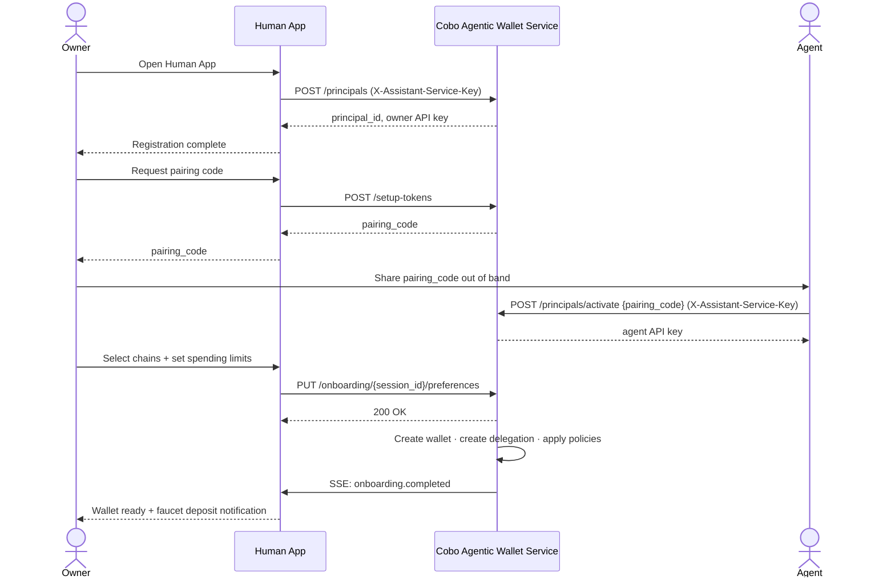
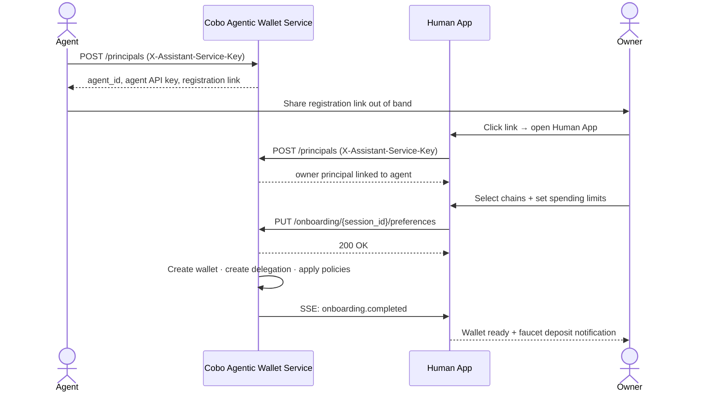

Every entity that interacts with Cobo Agentic Wallet is a **principal** — either a human or an AI agent.

| Type | Typical role | Authenticates via |
|---|---|---|
| `human` | Owner — creates wallets, sets policies, reviews logs | API Key (`X-API-Key`) |
| `agent` | Operator — executes delegated actions within limits | API Key (`X-API-Key`) |

A **human** becomes a principal by authenticating via the Human App or Web Console. An **agent** becomes a principal by calling the API to register itself. Both receive a principal ID and interact via that ID.

<Info>
  `human` and `agent` are labels — the system does not restrict which type can own a wallet or hold a delegation. A `type=agent` principal can own wallets just like a human.
</Info>

After registration, an **API key is automatically issued** for the new principal. Additional keys can be created or revoked at any time (see below).

Principals can also be provisioned directly using a Service Credential at bootstrap time — useful for scripted setup.

## Onboarding sequence

Two paths exist depending on who initiates setup. Both converge at the wallet creation step.

**Owner registers first**



**Agent registers first**



## Create a principal

Requires the `X-Assistant-Service-Key` service credential header.

```python
from cobo_agentic_wallet.client import WalletAPIClient

bootstrap = WalletAPIClient(base_url=API_URL, api_key="")
bootstrap._session.headers["X-Assistant-Service-Key"] = SERVICE_KEY

# Create a human owner
owner = await bootstrap.create_principal(
    external_id="owner-alice",   # your system's user ID
    principal_type="human",
    name="Alice",
)

# Create an AI agent operator
agent = await bootstrap.create_principal(
    external_id="agent-trading-bot",
    principal_type="agent",
    name="Trading Bot",
)
```

**Response fields:**

| Field | Description |
|---|---|
| `id` | UUID — used in delegations and API key creation |
| `external_id` | Your system's identifier |
| `type` | `human` or `agent` |
| `name` | Display name |
| `created_at` | ISO 8601 timestamp |

`create_principal` is idempotent on `external_id` — calling it twice returns the same principal.


## Issue an API key

API keys are how principals authenticate. Issue one per principal (or multiple with different scopes).

```python
# Issue with full access
owner_key = await bootstrap.create_api_key(
    principal_id=owner["id"],
    name="owner-primary-key",
    scopes=["*"],
)
raw_key = owner_key["raw_key"]  # only returned once — store securely

# Issue with limited scope (read-only)
read_key = await bootstrap.create_api_key(
    principal_id=owner["id"],
    name="owner-read-key",
    scopes=["*:read"],
)

# Issue with expiry
import datetime
expiring_key = await bootstrap.create_api_key(
    principal_id=agent["id"],
    name="agent-temp-key",
    scopes=["wallets:*", "delegations:read"],
    expires_at=(datetime.datetime.now(datetime.UTC) + datetime.timedelta(days=30)).isoformat(),
)
```

<Warning>
  `raw_key` is returned **only once**. Store it immediately in a secrets manager or environment variable.
</Warning>

### Scope syntax

| Scope | Access |
|---|---|
| `*` | Full access to all resources and actions |
| `*:read` | Read-only access across all resources |
| `wallets:*` | All actions on wallets |
| `wallets:read` | Read wallets only |
| `delegations:write` | Create/update delegations |


## List API keys

```python
owner_client = WalletAPIClient(base_url=API_URL, api_key=raw_key)

keys = await owner_client.list_api_keys()
for key in keys.get("items", []):
    print(key["id"], key["name"], key["scopes"], key.get("expires_at"))
```


## Revoke an API key

```python
await owner_client.revoke_api_key(api_key_id="<key-uuid>")
```

Revoked keys are immediately rejected by the Cobo Agentic Wallet service.


## List principals

Any authenticated principal can list all principals in the system:

```python
principals = await owner_client.list_principals(limit=50, offset=0)
for p in principals.get("items", []):
    print(p["id"], p["type"], p["name"])
```


## Authentication in requests

Pass the API key in every request via the `X-API-Key` header:

```bash
curl -H "X-API-Key: <raw_key>" https://your-api/api/v1/wallets
```

The SDK handles this automatically when you pass `api_key` to `WalletAPIClient`.


## Bootstrap vs. API key auth

| Endpoint | Requires |
|---|---|
| `POST /principals` | Service Credential only |
| `POST /api-keys` (for another principal) | Service Credential |
| `POST /api-keys` (for yourself) | Your own API key |
| All other endpoints | API key |
