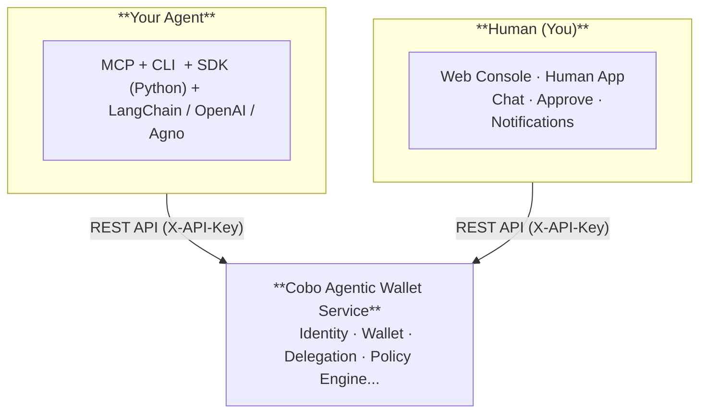

## Component overview

## Cobo Agentic Wallet Service

The Cobo Agentic Wallet service is the single source of truth for all wallet, identity, delegation, policy, and audit state.

### Modules

| Module | Responsibility |
|---|---|
| **Identity** | Principal CRUD, API key issuance and verification, scope enforcement |
| **Wallets** | Wallet + address lifecycle; executing on-chain transactions |
| **Transactions** | Transfer and contract call submission; fee estimation; WaaS webhook handling |
| **Delegations** | Owner → Operator scoped permission grants with expiry and freeze/unfreeze |
| **Policy Engine** | Three-stage gate: ① permission check → ② policy rule evaluation → ③ counter limits |
| **Audit Pipeline** | Logs every allow/deny/approval decision; SSE event stream |

### Authentication

| Method | Header | Who uses it | Scope |
|---|---|---|---|
| **Service Credential** | `X-Assistant-Service-Key` | Human Interface service, provisioning scripts | Bootstrap only: `POST /principals`, `POST /api-keys` |
| **API Key** | `X-API-Key` | Owners, Operators, SDK, CLI, MCP | All business operations |

## Python SDK

The SDK is a pure Python client library that all developer-facing integrations build on.

| Layer | What it is |
|---|---|
| `WalletAPIClient` | Async HTTP client — direct access to all Cobo Agentic Wallet service endpoints |
| `AgentWalletToolkit` | 7 agent runtime tools (transfer, balance, contract call, etc.) wrapped for LLM consumption |
| Framework adapters | LangChain, OpenAI Agents, Agno, CrewAI — each wraps the toolkit in the framework's tool format |
| MCP Server | Stdio server exposing the same 7 tools to any MCP-compatible client |
| CLI (`caw`) | Shell command interface for developers and AI coding assistants |

## Human Interfaces

Two interfaces let wallet owners manage policies, approve transactions, and monitor activity — no code required.

| Interface | Description |
|---|---|
| **Web Console** | Browser-based. Onboard, configure policies, and get AI-assisted guidance. |
| **Human App** | Mobile app. Keys stay on your device. Approve transactions, manage policies, and chat with the AI assistant. |

