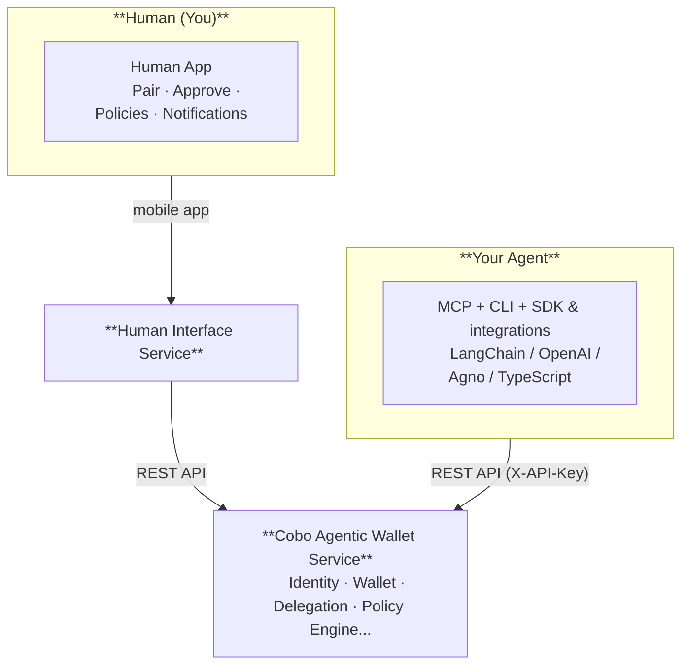

## Component overview

## Platform responsibilities

| Platform | Primary role |
|---|---|
| **CLI (`caw`)** | Create wallets, execute transactions, generate pairing codes, submit pacts — the agent-native interface |
| **Human App** | Pair agents, manage owner guardrails, approve pacts and over-limit transactions, freeze/revoke, review activity, back up keys |

## Cobo Agentic Wallet Service

The Cobo Agentic Wallet service is the single source of truth for all wallet, identity, delegation, policy, and audit state.

### Modules

| Module | Responsibility |
|---|---|
| **Identity** | Principal CRUD, API key issuance and verification, scope enforcement |
| **Wallets** | Wallet + address lifecycle; executing on-chain transactions |
| **Transactions** | Transfer and contract call submission; fee estimation; WaaS webhook handling |
| **Delegations** | Owner → Operator scoped permission grants with expiry and freeze/unfreeze |
| **Pact** | Pact lifecycle management — agents submit pacts, owners approve them, system creates delegations and API keys automatically on approval |
| **Policy Engine** | Three-stage gate: ① permission check → ② policy rule evaluation → ③ counter limits |
| **Audit Pipeline** | Logs every allow/deny/approval decision; delivers events via webhook outbox |

### Authentication

| Method | Header | Who uses it | Scope |
|---|---|---|---|
| **API Key** | `X-API-Key` | Owners, Operators, SDK, CLI, MCP | All business operations |

## SDK & integrations

The Python SDK is a pure Python client library that all Python developer-facing integrations build on. The TypeScript SDK provides equivalent functionality for Node.js and TypeScript environments.

| Layer | What it is |
|---|---|
| `WalletAPIClient` (Python) | Async HTTP client — direct access to all Cobo Agentic Wallet service endpoints |
| `WalletAPIClient` (TypeScript) | Promise-based HTTP client with full TypeScript types — same endpoint coverage as the Python client |
| `AgentWalletToolkit` | 7 agent runtime tools (transfer, balance, contract call, etc.) wrapped for LLM consumption |
| Framework adapters | LangChain, OpenAI Agents, Agno, CrewAI — each wraps the toolkit in the framework's tool format |
| CLI (`caw`) | Shell command interface for developers and AI coding assistants |

The MCP Server (`cobo-agent-wallet[mcp]`) is a separate stdio server that exposes the same wallet tools to any MCP-compatible client (Claude Desktop, Cursor, etc.).

## Human Interface

A separate service that provides the owner-facing experience.

| | |
|---|---|
| **Primary channel** | Human App — iOS / Android |
| **Owner tools** | Pair agent, manage owner guardrails, approve/reject pacts, approve/reject over-limit transactions, freeze/unfreeze, review activity |
| **Push notifications** | Delivered to the Human App for pact approvals and over-limit transaction reviews |

The Human Interface service holds an owner's API key and acts on behalf of the owner when calling the Cobo Agentic Wallet service.

## Security architecture

### Signing layer is isolated from the AI layer

Your agent interacts with the Cobo Agentic Wallet service through the REST API using an API key. The API key grants the agent permission to submit transaction requests — it does not give the agent access to private key material. Signing happens inside the Cobo Agentic Wallet service using Multi-Party Computation, which requires cooperation from multiple independent parties. The LLM component of your agent never sees, holds, or derives private keys.

### Policy engine as a structural guard

Every transaction request passes through a three-stage policy gate before anything executes on-chain:

1. **Permission check** — does this API key have permission to perform this operation type?
2. **Policy rule evaluation** — does this operation satisfy the owner's configured rules?
3. **Counter check** — does this operation stay within rolling spend limits?

This gate runs server-side and cannot be bypassed by the agent. Even if an attacker manipulates your agent into submitting a malicious transaction, the policy engine blocks it if it violates the owner's rules. The agent's intent is not trusted — only the request is evaluated against the rules.

### Prompt injection

Prompt injection — where malicious content in an external source hijacks an agent into performing unauthorized actions — is a real threat for agents that read external data. The policy engine provides structural protection: a successfully injected instruction cannot cause fund movement unless the resulting request passes the owner's spending limits and address allowlists.

For stronger protection at the agent layer, limit your agent's access to external data sources that are not necessary for the task, and keep spending limits and address allowlists as tight as possible for the operations your agent needs to perform.
