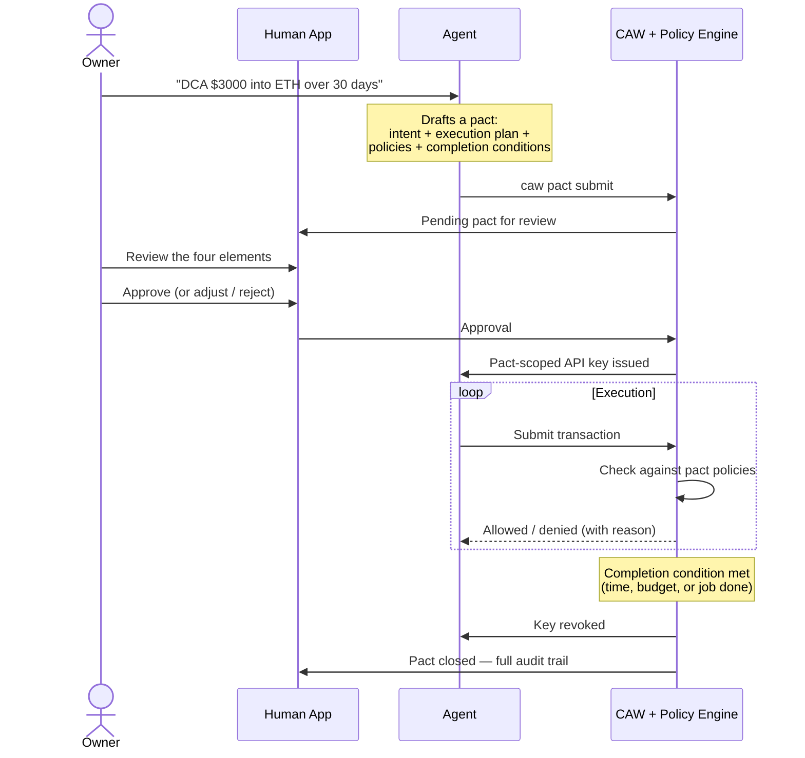

If you only read one page about Cobo Agentic Wallet, read this one. It walks through the **single motion** that makes CAW different from "give the agent a key": your intent becomes a structured proposal, you approve it in the Human App, and the wallet executes only what the pact allows — then revokes itself.

## The shape of one pact's life



The five stages:

1. **Intent** — you tell your agent, in plain language, what you want done.
2. **Draft** — the agent proposes a pact: intent, execution plan, policies, completion conditions. It does not yet have authority to act.
3. **Review** — the pact appears in your Human App. You see the four elements and any risks the agent flagged.
4. **Approve** — you approve, adjust the policies/completion conditions, or reject. Only on approval is a **pact-scoped API key** issued to the agent. Nothing moves before this.
5. **Execute** — the agent operates inside the pact. Every transaction is checked by the policy engine before it touches a chain. When a completion condition is met, the key revokes itself and the pact closes with a full audit trail.

## What the human actually sees

The review step is the inflection point. In the Human App you see the four elements side by side and decide: approve as-is, adjust the policies or completion conditions before approving, or reject outright.

See [Review and approve pacts](/products/agentic-wallet/manual/get-started/approve) for the full owner-side workflow, and [What is a pact](/products/agentic-wallet/manual/learn/what-is-a-pact) for the conceptual deep-dive on the four elements.

## What the agent is actually doing

On the agent side, the same flow looks like a structured submit/poll/execute loop:

- `caw pact submit` posts the PactSpec and waits for owner action.
- On approval, the agent receives a pact-scoped API key whose authority is exactly the policies the owner approved — no more.
- Every subsequent call is evaluated by the policy engine, which can return ALLOW, DENY (with a machine-readable reason the agent can act on), or escalate to a pending operation.
- On completion, the key is invalidated server-side. The agent's next call returns an authentication error.

See [Pact lifecycle](/products/agentic-wallet/manual/developer/pact-lifecycle) for PactSpec fields, the state machine, and code examples in CLI / Python / TypeScript, and [Pact mechanism](/products/agentic-wallet/manual/security/pact-mechanism) for the security properties of pact-scoped credentials.

## Where domain knowledge comes from (preview)

<Info>**Coming with the April release: the Recipe Repository.**</Info>

Drafting an accurate pact for "DCA into ETH on Base via Uniswap" requires domain knowledge: which contract addresses, which approval flow, which risks. Today the agent has to bring that knowledge itself. Soon, it will look it up.

A **Recipe** is a short markdown "domain-knowledge capsule" — a few hundred tokens covering one operation (e.g. `aave-v3-lending`, `uniswap-v3-swap`, `binance-spot`). Each recipe contains:

- **Overview** — what the operation is, contract addresses, supported tokens.
- **Typical Flow** — the step-by-step transaction sequence (approve → call → settle).
- **Safety & Risks** — concrete rules and risks the agent must respect.

The agent runs a single command:

```bash
caw recipe find "<query>"
```

…which returns the most relevant recipes (hybrid keyword + semantic match). The agent composes the knowledge from one or more recipes into the pact's `execution-plan` and `policies`, then submits as usual. Recipes are **knowledge, not workflow**: the user still decides what to do, the owner still decides what's allowed, the recipe just tells the agent what it needs to know to draft the pact accurately.

This means the **flow on this page does not change** when recipes ship — recipes just make Stage 2 (Draft) much more reliable for known protocols.

## Next

- [Review and approve pacts](/products/agentic-wallet/manual/get-started/approve) — the owner side, in detail
- [What is a pact](/products/agentic-wallet/manual/learn/what-is-a-pact) — the four elements
- [Pact lifecycle](/products/agentic-wallet/manual/developer/pact-lifecycle) — the developer side, with code
- [Pact mechanism](/products/agentic-wallet/manual/security/pact-mechanism) — how enforcement is structural, not best-practice
