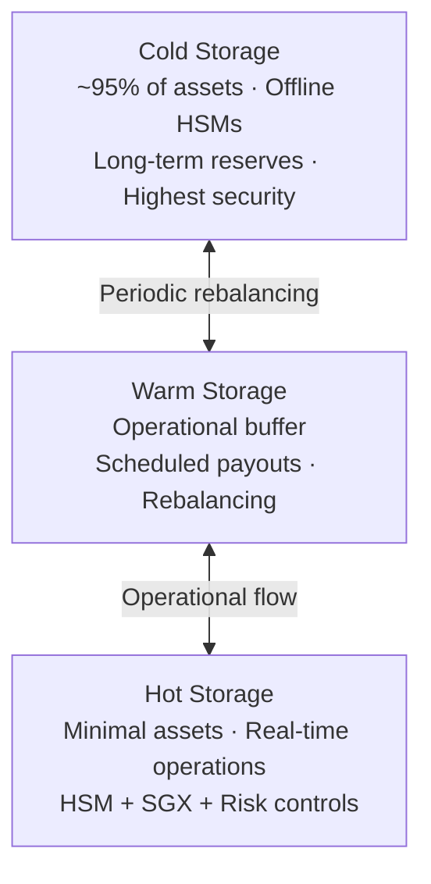
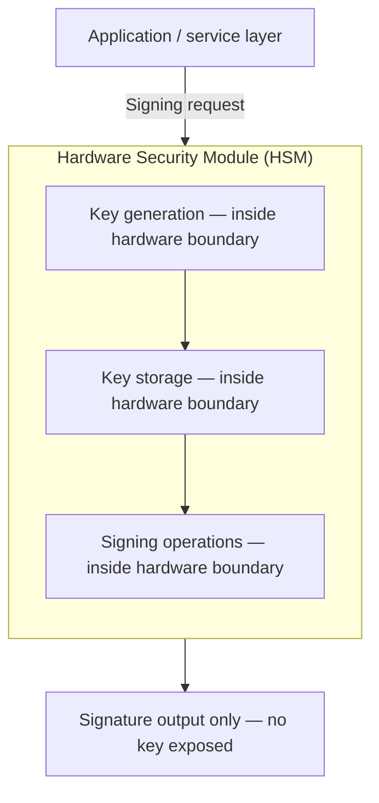

With a custodial wallet, your private keys are protected by Cobo's institutional-grade infrastructure. Keys are generated and stored inside hardware security modules engineered to prevent extraction by any party — including Cobo's own operators. No person can retrieve a key in plaintext; all signing operations run inside the hardware boundary itself. The security of your assets rests on the physical and cryptographic properties of the infrastructure, not on trusting any individual or team.

<Info>
If you are using an MPC wallet, your security model is different — key shares are distributed between you, your agent, and Cobo so no single party can act unilaterally. See [MPC Model](/security/mpc-key-shares).
</Info>

## Three-tier asset segregation

Cobo's custodial architecture separates assets into three tiers matched to security requirements and operational frequency. The vast majority of assets sit in the most secure tier and are never touched by day-to-day operations.

| Tier | Typical share | Access pattern | Primary controls |
|---|---|---|---|
| **Cold** | ~95% of assets | Offline only | FIPS-certified HSMs in physically isolated environments; no network connectivity |
| **Warm** | Operational buffer | Periodic | Scheduled payouts, settlement, rebalancing between cold and hot |
| **Hot** | Minimal | Real-time | Online; HSM + Intel SGX secure enclaves + risk-control engine |

### Cold storage

Cold wallets protect long-term and high-value holdings. Private keys are generated and stored entirely within FIPS-certified HSMs in offline or physically isolated environments. Keys never leave hardware. All operations require strict approval workflows before any asset movement is initiated.

Cold storage minimizes attack surface and ensures that the majority of assets remain unreachable from online systems under any operational condition.

### Warm storage

Warm wallets serve as an intermediate buffer between cold and hot. They support periodic rebalancing, settlement, and scheduled payouts — medium-frequency workflows that do not require real-time execution but still need timely handling. Warm storage reduces hot wallet exposure while enabling smoother operational throughput.

### Hot storage

Hot wallets are online and optimized for speed. They hold only a minimal share of total assets and power real-time business flows such as instant withdrawals, exchange operations, and API-driven interactions.

Even in the online tier, additional controls protect against hot-wallet risk:

- **Bank-grade HSMs** — private keys are stored in hardware even for online operations; keys never appear in plaintext outside the module
- **Intel SGX secure enclaves** — hardware-level memory isolation for key operations, protecting against attacks that target running processes
- **Risk-control engine** — real-time on-chain monitoring and policy-based controls (spend limits, address allowlists/blocklists, IP restrictions) that gate every outgoing transaction

These controls limit the impact of any hot-wallet incident and ensure that high-speed operational flows do not compromise assets in warm and cold tiers.

## HSM-based key isolation

Across all tiers, private key security is anchored by FIPS 140-2 certified Hardware Security Modules (HSMs). HSMs provide a tamper-resistant environment where private keys are generated, stored, and used exclusively within hardware. If physical tampering is detected, built-in mechanisms trigger automatic zeroization of key material.

The application layer above the HSM can request that a signature be produced, but it can never extract the key itself. Even an attacker with full administrative access to the host server cannot reach key material held inside the HSM boundary.

## Infrastructure resilience

Cobo's custodial infrastructure is deployed across multiple geographic regions and availability zones:

- No single data center failure causes asset unavailability
- Jurisdictional requirements for data residency can be met
- Correlated failures in one region do not affect others

Physical data centers use controlled access, surveillance, redundant power, and environmental safeguards consistent with high-security infrastructure standards.

## Operational controls

Access to custodial key operations is governed by role-based access control, multi-factor authentication, and multi-party approval requirements for all privileged operations. All key operations are logged and auditable.

Cobo conducts regular penetration tests and simulated attack exercises to validate that custodial controls remain effective against evolving threat conditions.

<Info>
For details on how transaction policies and spend limits are enforced on custodial wallet operations, see [Policy Engine](/security/policy-engine) and [Spend Limits](/security/spend-limits).
</Info>
