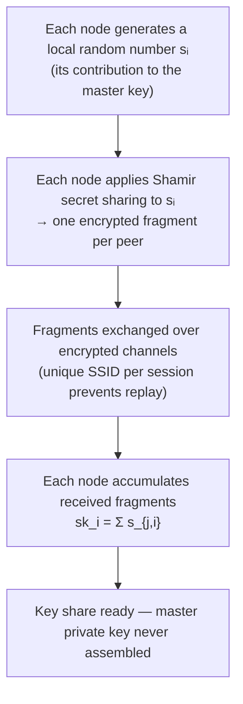
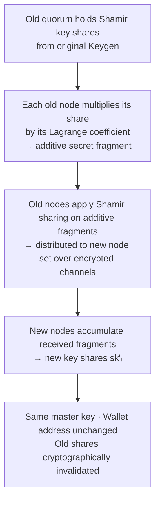
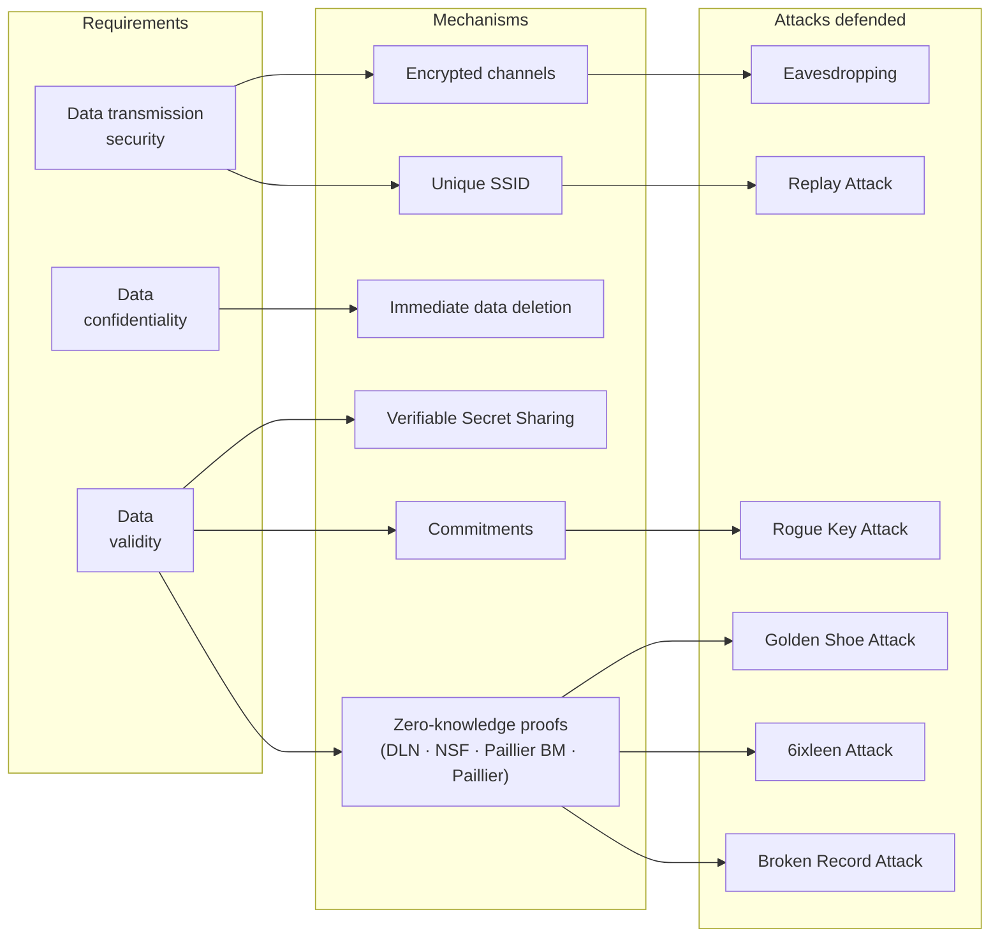

When people think about MPC security, they tend to focus on the signing ceremony — the moment when partial signatures are combined into a valid on-chain transaction. But the signing ceremony depends entirely on something that happened earlier: the key generation and, when nodes change, the resharing of those keys.

Keygen and resharing are brief operations in the life of a wallet, but they are among the most cryptographically demanding. This page explains how they work, what security requirements they must meet, and what specific mechanisms Cobo uses to meet them.

## What keygen does

When a wallet is created, the participating MPC nodes run a **Distributed Key Generation (DKG)** protocol. The goal is for each node to end up with a key share — a fragment that carries partial signing authority over the wallet — while the complete private key never comes into existence in any one place.

The mechanism is **Joint Secret Sharing**. Each node independently generates a random number, which is its contribution to the master private key. The nodes never pool these contributions directly. Instead, each node performs a Shamir secret sharing of its own contribution and distributes the resulting fragments to the other nodes over encrypted channels. Every node then accumulates the fragments it received and combines them into its key share.

Mathematically: if five nodes participate and node `P_i` contributes random value `s_i`, the master private key is `sk = Σ s_i`. Each node ends up with `sk_i = Σ s_{j,i}` — a sum of one fragment from each other participant. The master private key satisfies the sum relationship at the logical level but is never physically assembled.

The wallet's public key — and therefore its on-chain address — is derived from the shared public key that all nodes can compute locally. It is ready for use the moment DKG completes.

## What resharing does

Resharing allows the set of signing nodes to change — nodes can leave or join — without changing the wallet's private key or on-chain address.

The existing quorum first converts their Shamir key shares into **additive secret shares** by multiplying each share by its Lagrange coefficient. This converts the polynomial-form shares into a representation that can be re-shared directly. The active nodes then perform a new round of Shamir secret sharing on these additive shares, distributing fragments to all nodes in the new configuration. Each new node accumulates its fragments into its new key share.

The result: the new set of nodes holds fresh key shares that correspond to the same master private key as before. The wallet address is unchanged, no on-chain migration is needed, and the old shares — held by departed nodes — are cryptographically invalidated the moment resharing completes. An attacker who obtained a copy of an old share gains nothing after the reshard.

## The three security requirements

Keygen and resharing are complex algorithms executed across a multi-party communication protocol. Their security requirements fall into three categories:

**Data transmission security** — The secret fragments exchanged between nodes during the protocol must not be leaked, tampered with, or replayed by an attacker.

**Data confidentiality** — Key-related values must never exist in raw, reconstructable form during the protocol. They should not be stored locally in a way that exposes them.

**Data validity** — The data generated during the protocol must be mathematically correct and conform to the protocol specification. This is the hardest requirement: validity must be verified without breaking confidentiality, which requires advanced cryptographic tools.

## How Cobo meets each requirement

### Encrypted channels and per-session SSID

The secret fragments exchanged between nodes are transmitted over encrypted channels. This prevents an eavesdropper from intercepting fragment values that, if collected across nodes, could expose the master private key.

Each keygen execution uses a unique **session ID (SSID)**. The SSID binds the protocol messages to a specific session, so an attacker cannot capture messages from one keygen run and replay them in a later session to exhaust compute or storage resources.

### Immediate deletion of intermediate values

During keygen, each node's contribution to the master private key is a locally generated random number. Once a node has produced the Shamir fragments of that number and transmitted them to the other nodes, the original random number is deleted from local memory immediately.

This minimizes the window during which the random number exists in its "complete form" on any device. If an attacker compromised a node after this deletion, the random number would be gone — the node's key share would be present, but the intermediate value that could theoretically be used to reconstruct partial key information is not.

### Verifiable Secret Sharing, commitments, and zero-knowledge proofs

Meeting the data validity requirement while preserving confidentiality requires several cryptographic mechanisms working together.

**Verifiable Secret Sharing (VSS)** ensures that the fragments a node receives from other nodes are consistent with a valid secret — not maliciously crafted values that could corrupt the key share or leak information about the master key.

**Commitments** protect the randomness of each node's contribution. Rather than immediately sharing its random number, each node first publishes a cryptographic commitment to it. Sharing does not begin until all nodes have committed. This prevents a **Rogue Key Attack**, where a malicious node chooses its contribution *after* seeing what others have committed, allowing it to bias the master private key and later forge signatures. The commitment scheme's security rests on the elliptic curve discrete logarithm problem.

**Zero-knowledge proofs** are the most critical mechanism for data validity. Cobo's implementation uses four ZKP protocols during keygen and resharing:

| ZKP protocol | What it validates |
|---|---|
| DLN Proof | Discrete log relationship between Paillier key components |
| No Small Factor Proof | That the Paillier modulus has no small prime factors |
| Paillier Blum Modulus | That the modulus satisfies the Blum integer property |
| Paillier Proof | Correctness of the homomorphic encryption parameters |

These proofs validate the cryptographic parameters that nodes use for homomorphic encryption and range proofs during the protocol — without any node revealing its underlying values.

## Attacks these mechanisms defend against

The ZKP suite in particular defends against a class of attacks that are non-obvious but serious:

**Golden Shoe Attack** — An attacker provides maliciously constructed range proof parameters to honest nodes. During the range proof phase, the honest node inadvertently leaks raw key data because the parameters were designed to cause this. The ZKP protocols validate that range proof parameters are correctly formed before any proof is computed.

**6ixleen Attack** — An attacker constructs a malicious homomorphic encryption public key and submits fraudulent range proofs. If accepted, this gives the attacker the linear relationships between other nodes' key share fragments. With enough relationships, the attacker can apply the Chinese Remainder Theorem to recover the master private key. The ZKP protocols validate the homomorphic encryption parameters so malformed keys are rejected.

**Broken Record Attack** — An attacker repeatedly initiates signing operations and observes whether each attempt succeeds or fails. Each observation leaks one bit of private key information. Over enough rounds, the full private key can be reconstructed. This is addressed through the range proof parameter validation — the proofs ensure that intermediate values used in signing are properly bounded, blocking the oracle that this attack depends on.

**Rogue Key Attack** — As described above, a malicious node that observes others' commitments before setting its own contribution can bias the master private key in a way that lets it forge signatures later. The commitment scheme prevents this by ensuring all nodes commit before any sharing begins.

## Keygen is a one-time operation; resharing handles change

Key generation happens once, at wallet creation. The key shares produced during that single DKG run are reused for every subsequent transaction signing — there is no per-transaction key generation.

Resharing happens when the signing party configuration changes: when a node is replaced, when an agent is reprovisioned, or when a device is lost and recovery is needed. See [Key Share Recovery](/security/key-share-recovery) for the scenarios in which resharing is triggered and what to expect during the process.

<Info>
For a higher-level overview of threshold signing and who holds which shares, see [MPC Key Shares](/security/mpc-key-shares). For the signing ceremony itself — what happens after the shares exist — that page also covers the partial signature combination process.
</Info>
