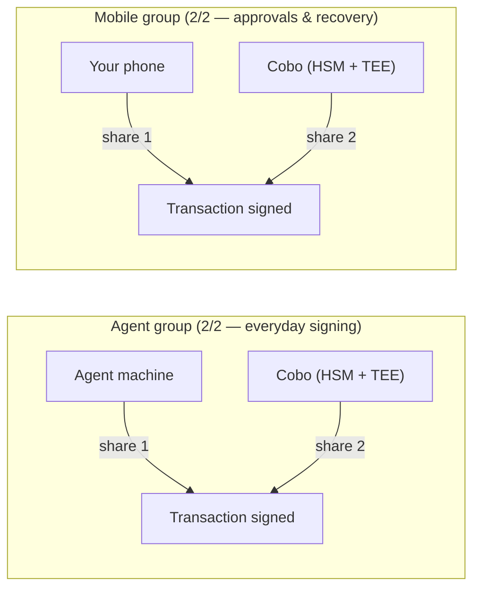
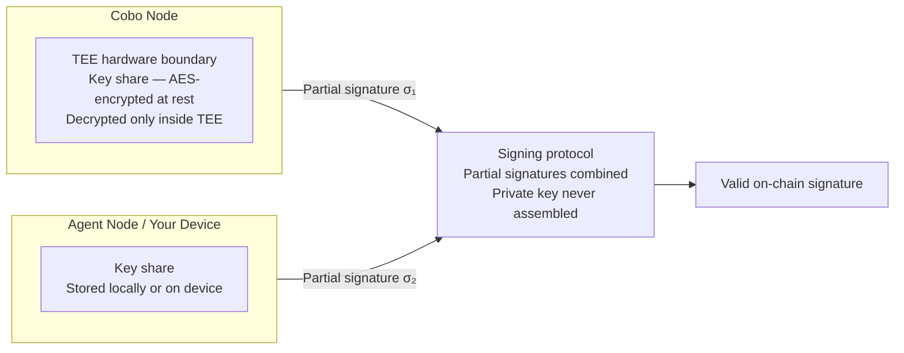

In an MPC wallet, no single party — not you, not your agent, not Cobo — ever holds a complete private key. Signing authority is split into independent key shares held by separate parties. A threshold number must cooperate to sign a transaction; none can act unilaterally.

This is fundamentally different from both self-custody and fully custodial wallets:

| Model | Who holds the key | Risk |
|---|---|---|
| **Self-custody** | You alone | Lose the key, lose the funds |
| **Fully custodial** | Cobo alone | Cobo's infrastructure is the single point of trust |
| **MPC (co-custodial)** | Split across parties | No single party can act without the others |

<Info>
If you are using a fully custodial wallet, Cobo holds keys on your behalf and security comes from infrastructure controls rather than key splitting. See [Custodial Model](/security/custodial-model).
</Info>

## What Cobo can and cannot do

Because Cobo holds only one key share, it has bounded authority over your wallet:

**Cobo can:**
- Co-sign transactions that pass your policy rules
- Enforce policy checks before co-signing
- Freeze or suspend signing for wallets flagged by your rules
- Provide access to the audit trail

**Cobo cannot:**
- Sign transactions without the other party's share — Cobo's share alone cannot move funds
- Bypass your policies — every transaction must pass the policy engine before Cobo co-signs
- Access your device's key share — your device share never leaves your phone
- Reconstruct the full private key — the TSS protocol never combines shares into a single key

## How key shares are distributed

### Before claiming — one key group

When your agent runs `caw onboard`, a single key group is created:

| Party | Share | Scheme |
|---|---|---|
| Agent machine (TSS node) | Share 1 | 2-of-2 — both required |
| Cobo | Share 2 | 2-of-2 — both required |

Your agent uses this group for all everyday signing. Both parties must cooperate for every transaction.

### After claiming — two independent key groups

When you claim the wallet in the Human App, a second key group is created on your device:

| Group | Party | Share | Scheme |
|---|---|---|---|
| **Agent group** | Agent machine | Share 1 | 2-of-2 |
| | Cobo | Share 2 | |
| **Mobile group** | Your phone | Share 1 | 2-of-2 |
| | Cobo | Share 2 | |

The two groups are independent. Your agent uses the agent group for daily transactions within your policy limits. Your phone's group is used when you co-sign over-limit operations and for key backup and recovery.

**Why two groups?** The agent group handles automatic signing within your policy — your phone does not need to be involved for routine operations. The mobile group handles over-limit operations (where you must approve) and key recovery. Keeping them separate means everyday transactions don't interrupt you.

## How key shares are protected: MPC + TEE

Cobo's MPC nodes combine two independent layers of protection for key shares.

**MPC: cryptographic separation**

The private key is never generated as a whole. Each MPC node independently creates its own random key share, and the full key only "exists" in the logical sense — as the sum of all contributions — but is never assembled at any point. Signing requires every participating node to compute a partial signature from its own share; the partial signatures are then combined into a valid on-chain signature without the key ever being reconstructed.

**TEE: hardware-level isolation**

For Cobo-operated nodes, key shares are protected at the hardware level by Trusted Execution Environments (TEEs). TEEs provide isolated execution environments where key material is processed in memory that is inaccessible to the host operating system, privileged software, and even Cobo's own administrators.

Specifically:
- Key shares are never stored on disk in plaintext — they are encrypted using AES and can only be decrypted within the TEE
- The encryption key protecting the key shares is itself held inside the TEE hardware boundary
- MPC nodes require a manual startup passphrase that is never stored in the system — this prevents unauthorized startup or reuse of a captured node image

## The signing ceremony

When a transaction is submitted and clears the policy engine, a TSS signing ceremony takes place:

<Steps>
  <Step title="Signing request distributed">
    The transaction data is sent to each participating party's MPC node.
  </Step>
  <Step title="Partial signatures computed">
    Each node computes a partial signature using its own key share. The partial signature is mathematically linked to the transaction data but reveals nothing about the underlying share.
  </Step>
  <Step title="Partial signatures combined">
    The partial signatures are combined — using the TSS protocol — into a single, valid on-chain signature. This combination does not require any party to reveal their share.
  </Step>
  <Step title="Signature broadcast">
    The combined signature is broadcast to the blockchain network. From the network's perspective, it is indistinguishable from a signature produced by a single private key.
  </Step>
</Steps>

## What "compromising one share" actually means

If an attacker compromises a single key share — even with full access to the file system and private memory of one party — they cannot move funds. They hold a fragment that is useless without the cooperation of the other party.

For the agent group (2/2), an attacker would need to simultaneously compromise Cobo's TEE-protected HSM infrastructure and the agent machine — independent systems with separate security controls.

<Warning>
The 2/2 trust boundary means that a simultaneous compromise of both Cobo's infrastructure and the agent machine would allow signing. This is why Cobo's policy enforcement layer — which runs before co-signing — is a critical complementary control.
</Warning>

## Agent key share lifecycle

Agent-side key shares are generated once during wallet creation (`caw onboard`). They are stored locally under `~/.cobo-agentic-wallet/profiles/` and are reused for all subsequent signing operations.

When a pact expires, is revoked, or is completed, the pact-scoped API key issued to the agent is invalidated immediately. The underlying key shares are unaffected — only the agent's authorization to request signing is removed.

<Warning>
Back up the profile directory at `~/.cobo-agentic-wallet/profiles/` after onboarding. Loss of this directory without a recovery mechanism means the agent's share of the 2/2 threshold cannot be contributed, and the wallet cannot sign new transactions until key recovery is completed.
</Warning>

## Further reading

- [Key Generation and Resharing](/security/keygen-resharing) — the cryptographic detail behind how key shares are created and refreshed
- [Key Share Recovery](/security/key-share-recovery) — what to do when a share is lost
- [MPC Security Model](/developer/concepts/mpc-security) — developer-focused technical details on the TSS protocol and threat model
