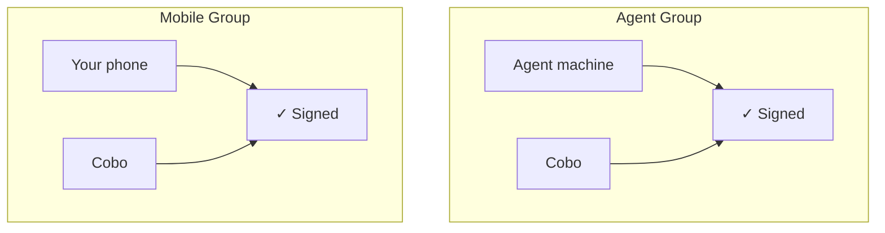
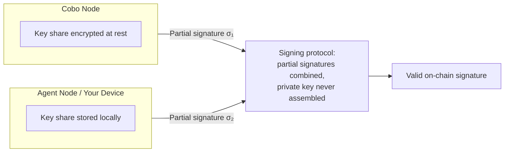

MPC provides a mathematical guarantee, not a software promise. In an MPC wallet, no single party ever holds a complete private key. Signing authority is split into independent key shares held by separate parties, and within each key group, all parties must cooperate to sign — no single party can sign a transaction alone.

This is fundamentally different from both self-custody and fully custodial wallets:

| Model | Who holds the key | Risk |
|---|---|---|
| **Self-custody** | You alone | Lose the key, lose the funds |
| **Fully custodial** | Cobo alone | Cobo's infrastructure is the single point of trust |
| **MPC (non-custodial)** | Split across parties | Cobo cannot act without your key share |

<Info>
If you are using a fully custodial wallet, Cobo holds keys on your behalf and security comes from infrastructure controls rather than key splitting. See [Custodial Model](/products/agentic-wallet/manual/security/custodial-model).
</Info>

## How MPC key shares are distributed in Cobo Agentic Wallet

### Before pairing — one key group

When your agent runs `caw onboard`, a single key group is created:

| Group | Scheme | Party | Share |
|---|---|---|---|
| **Group1: Agent Group** | 2-of-2 | Agent machine | Share 1 |
| | | Cobo | Share 2 |

Your agent uses this group for all everyday signing. Both parties must cooperate for every transaction.

### After pairing — two independent key groups

When you pair the wallet in the Cobo Agentic Wallet app, a second key group is created on your device:

| Group | Scheme | Party | Share |
|---|---|---|---|
| **Group1: Agent Group** | 2-of-2 | Agent machine | Share 1 |
| | | Cobo | Share 2 |
| **Group2: Mobile Group** | 2-of-2 | Your phone | Share 1 |
| | | Cobo | Share 2 |

The two groups are independent.

The Agent Group signs any transaction your agent initiates. The Mobile Group signs any transaction you initiate from the app — such as transfers you make directly.

## What Cobo can and cannot do

Because Cobo holds only one key share, it has bounded authority over your wallet:

**Cobo can:**
- Co-sign transactions that pass your policy rules
- Enforce policy checks before co-signing
- Provide access to the audit trail

**Cobo cannot:**
- Sign transactions without the other party's share — Cobo's share alone cannot move funds
- Bypass your policies — every transaction must pass the policy engine before Cobo co-signs
- Access your device's key share — your device share never leaves your phone

## How Cobo's key shares are protected

**MPC: cryptographic separation**

The private key is never generated as a whole. Each MPC node independently creates its own random key share, and the full key only "exists" in the logical sense — as the sum of all contributions — but is never assembled at any point. Signing requires every participating node to compute a partial signature from its own share; the partial signatures are then combined into a valid on-chain signature without the key ever being reconstructed.

Key shares are stored encrypted at rest. MPC nodes require a manual startup passphrase that is never stored in the system — this prevents unauthorized startup or reuse of a captured node image.

## The signing ceremony

When a transaction is submitted and clears the policy engine, a TSS signing ceremony takes place:

<Steps>
  <Step title="Signing request distributed">
    The transaction data is sent to each participating party's MPC node.
  </Step>
  <Step title="Partial signatures computed">
    Each node computes a partial signature using its own key share. The partial signature is mathematically linked to the transaction data but reveals nothing about the underlying share.
  </Step>
  <Step title="Partial signatures combined">
    The partial signatures are combined — using the TSS protocol — into a single, valid on-chain signature. This combination does not require any party to reveal their share.
  </Step>
  <Step title="Signature broadcast">
    The combined signature is broadcast to the blockchain network. From the network's perspective, it is indistinguishable from a signature produced by a single private key.
  </Step>
</Steps>

## What "compromising one share" actually means

If an attacker compromises a single key share — even with full access to the file system and private memory of one party — they cannot move funds. They hold a fragment that is useless without the cooperation of the other party.

For the Agent Group (2/2), an attacker would need to simultaneously compromise Cobo's infrastructure and the agent machine — independent systems with separate security controls.

## Further reading

- [Key Share Backup and Recovery](/products/agentic-wallet/manual/security/key-share-backup) — how to back up and restore your key share
- [Technical Architecture](/products/agentic-wallet/manual/developer/technical-architecture) — how the runtime, owner controls, and CAW service fit together
